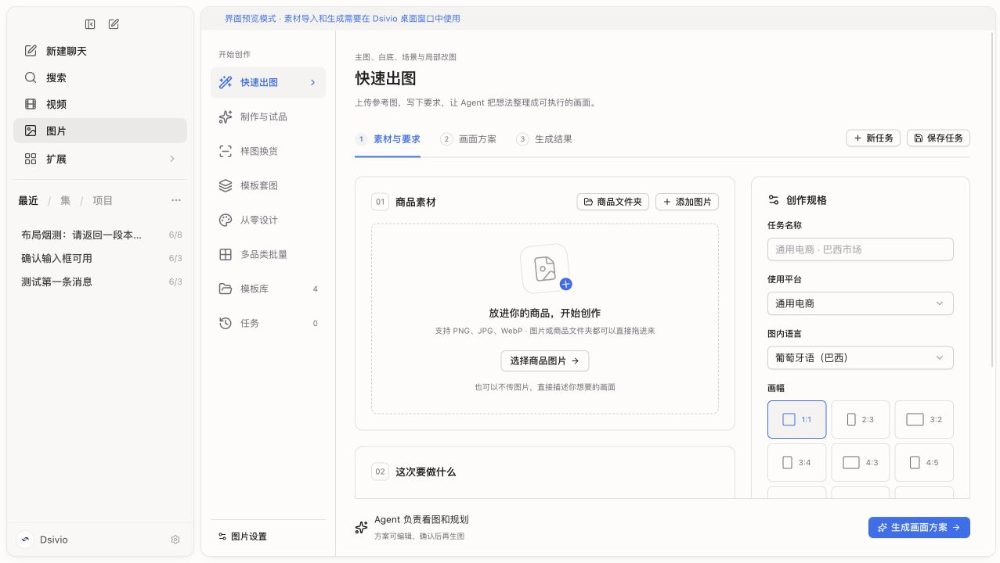
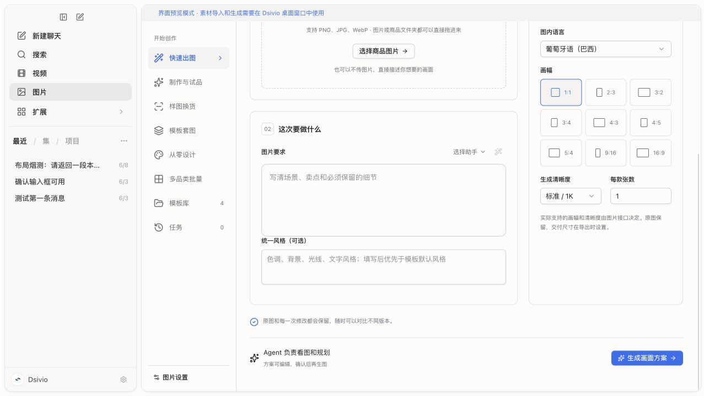
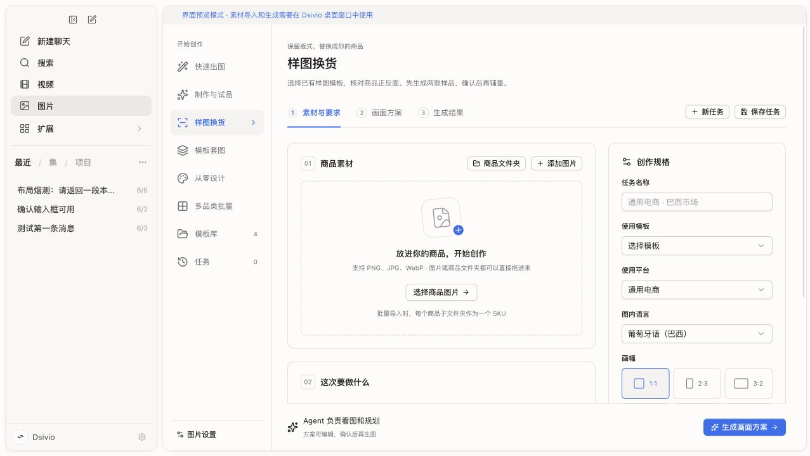
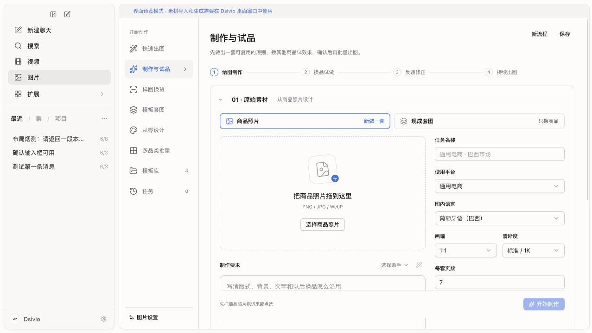
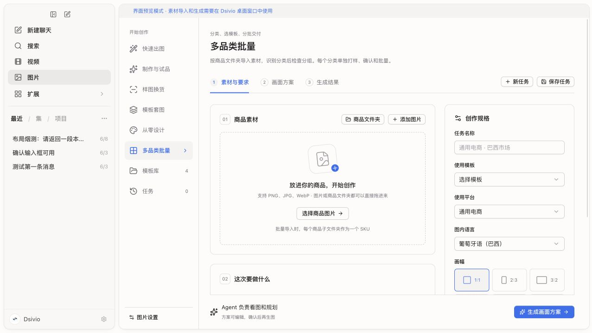
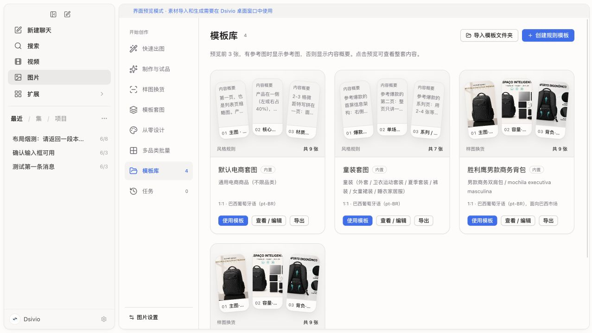

# dsimage 新手界面与流程审查

审查日期：2026-09-09。目标：让不熟悉 skill 的用户知道从哪里开始、需要提供什么、下一步会发生什么。

用户补充的产品原则：正反面由系统自动识别，缺少所需视角时自动生成。用户无需选正背面、组织参考图或处理补图步骤。识别、补图、分类、挑选试做商品、编写提示词和组织模板均作为后台工作。默认交互围绕“提供素材和要求 → 查看结果 → 提出修改”；批量前保留试做效果确认。以下建议已据此修订，上游 skill 中的人工处理环节仅用于对照，不直接照搬为用户界面。

初次审查结论：需要调整入口分类和步骤编排。页面把执行模式、用户任务、模板制作和批量生产放在同一级，并用一张通用表单承接差异很大的任务。仅调整按钮尺寸和间距无法解决这些问题。

后续实施说明：用户明确要求保留 dsimage 各流程的独立功能页，因此最终采用五个出图入口；模板制作移入次级工具区。以下截图为改版前的审查证据，后续实现与验证见 [implementation.md](implementation.md)。

## 证据与范围

- 用户提供的桌面截图。
- 本轮在本地运行中的前端预览检查六个页面状态，截图已经保存并重新打开核对；预览截图为 1277 × 720，用户截图为另一窗口尺寸与缩放，不能按像素直接比较。
- 当前工作区的 React 界面、Rust 工作台动作、导入和规划逻辑。审查结束时 HEAD 为 `218e1a8`；未修改应用源码。
- 对照 GitHub dsimage 的 `SKILL.md`、`guides/gen.md`、`guides/design.md`、`guides/client.md`。远端 main 核对到 `bc83321d19cf51f694b1aa06efbc4cdcc7effd34`。
- 原 skill 文档作为产品行为的对照资料；文档中的出图、配置及执行指令未作为本次操作指令执行。

这是入口、输入与流程衔接审查。浏览器明确处于预览模式，素材导入和图片生成依赖桌面运行时。本轮没有调用生图 API；真实导入后的状态、生成耗时、样品质检、重试与交付未做端到端实测。以下涉及这些阶段的发现会明确标注为代码证据。

## 本轮逐步检查

| 步骤 | 页面状态 | 健康度 | 主要发现 |
| --- | --- | --- | --- |
| 1 | 快速出图首屏 | 需优先调整 | 六个创作入口；大上传框遮蔽主输入；三个上传入口；主按钮要求先规划 |
| 2 | 快速出图向下滚动 | 需优先调整 | 需求与统一风格分开填写；九种画幅展开；默认巴西葡语；选择助手增加理解成本 |
| 3 | 样图换货首屏 | 流程衔接不足 | 只有商品上传区，已有样图须先变成模板；模板选择埋在规格里 |
| 4 | 制作与试品首屏 | 局部方向正确，定位不清 | 商品照片/现成套图的二选一容易理解，但本质是模板制作；与其他入口重叠 |
| 5 | 多品类批量首屏 | 流程衔接不足 | 文案承诺分类，仍然落到通用表单；前端没有接上分类动作 |
| 6 | 模板库 | 可使用，需简化 | 有真实参考图的模板可预览；部分卡片显示细长、倾斜、截断的规则文本；使用与管理混排 |

### 1. 快速出图首屏

主要操作使用蓝色、导航和表单有明确分区，这些基础可以保留。但首屏视觉中心是一个可选的上传空框，必需的图片要求在下方。两列导航同时存在，正文空间受到挤压。

用户截图中同样出现大上传框、需求下沉和固定底部按钮。这说明问题不只来自本轮的预览尺寸。具体哪些宽度发生布局切换仍需在实现阶段验证。

### 2. 快速出图需求与规格

用户需要区分图片要求、统一风格、使用平台、图内语言、画幅、清晰度、每款张数，还能选择助手。对一张换背景图片而言，决策过多。页面应由“这张图要怎么改”驱动，其余使用可见的默认值与按需展开。

### 3. 样图换货

用户的自然任务是“这套样图的商品换成我的”。此页只能上传商品，再选择已经存在的模板。没有模板的新手不知道样图放在哪里，也看不出该去“制作与试品”。需要在这个入口直接承接现成样图和目标商品两个明确对象。

### 4. 制作与试品

“商品照片 → 新做一套”“现成套图 → 只换商品”比技术模式名称容易理解。可保留这段分流交互，但它不适合继续作为与从零设计、样图换货并列的第六条主路线。

源码中“开始制作”执行 `workflow_build`，先创建规则模板；后面还需添加商品并试做。按钮没有充分说明第一次产出是规则。这段更适合放入“制作模板”，或并入套图/换货流程，让后台完成模板工作。

### 5. 多品类批量

标题描述分类、选模板、分批交付，但页面步骤仍为素材、方案、结果。分类确认和每类样品审核应是这条路线真正的进度，不应让用户从标题说明中自行推断。

### 6. 模板库

背包模板有真实示例图，帮助用户判断结果，可以保留。没有参考图的 smart 模板显示内容概要是诚实的降级，但把长规则放进倾斜窄卡片会造成截断和阅读困难。建议改成平直的页面缩略图或简短的“主图 / 卖点 / 细节”安排，规则全文放到详情。

## 与原 skill 的主要偏差

| 原 skill 的意图 | 当前实现 | 对新手的影响 | 建议 |
| --- | --- | --- | --- |
| 根据材料和意图选一条路 | 六种创作入口同时展示，workflow 又覆盖设计与换货 | 开始前先学习内部分类 | 保留五条独立出图路线，将模板制作移到工具区 |
| gen：补齐缺失信息后直接出图 | 所有 gen 都必须生成方案，再点开始出图 | 简单任务多一次等待与确认 | 把规划留在后台；“先看方案”作为可选项 |
| gen 默认无文字；design 默认跟随用户语言；选模板时继承模板 | `emptyBrief` 对所有模式统一使用 `pt-BR` | 没注意语言时可能得到不想要的文案 | 按路线设置默认值，并在生成前展示摘要 |
| replace 使用既有模板规则，不重写生图 prompt | 后端确实直接组装模板 prompt，但 UI 仍说 Agent 正在规划并要求方案页 | 让人误以为需要重新设计 | 系统准备样图和商品素材后直接试做；用户查看效果 |
| design 先落成可复用 smart 模板，再出图 | 普通 design 直接生成页面方案，“存为规则模板”是后续可选动作 | 复用逻辑与原 skill 不同 | 后台先建立本任务规则；是否加入用户模板库可在满意后决定 |
| 大单：共用要求、分类确认、一类一模板、每类试样确认 | 后端有 classify；图片前端未调用；默认“未分类”，可逐品手填分类与模板 | 用户需要自己组织流程 | 系统自动分类并按类组织模板；用户通过试做结果确认效果 |
| 多图商品要看图选正面，必要时指定或派生背面 | 导入按文件名猜正背面，否则取首个非背面图片；普通素材区缺少选择控件 | 素材准备没有形成可靠的自动流程 | 后台看图识别正背面，缺少所需视角时自动补生成并检查一致性，不增加用户选择控件 |

源码定位：

- 入口与默认值：[types.ts](../../../src/chat/images/types.ts)，`FEATURES`、`emptyBrief`。
- 通用页面、保存和步骤：[ImageStudio.tsx](../../../src/chat/images/ImageStudio.tsx)，`switchView`、`act`、素材区、方案区。
- 模板制作及试品：[ImageWorkflow.tsx](../../../src/chat/images/ImageWorkflow.tsx)。
- 模板库：[StudioPanels.tsx](../../../src/chat/images/StudioPanels.tsx)。
- 原生动作与导入选择：[mod.rs](../../../src-tauri/src/image_studio/mod.rs)，`image_studio_import` 和 `classify/plan/generate/approve/bulk` 分支。
- 替换模板与逐页规划：[agent.rs](../../../src-tauri/src/image_studio/agent.rs)，`plan`、`template_refs`。
- 自动建规则：[workflow.rs](../../../src-tauri/src/image_studio/workflow.rs)，`build`。

当前工作台有自己的原生动作与专用 Agent 规划流程，因此更新原 skill 文档不会自动改变这些页面行为。需要把上述对照变成明确的界面和状态约定。

## 优先处理的体验问题

1. **主入口重叠。** “制作与试品”是模板制作过程，“模板套图”是素材来源/执行方式，“多品类批量”是任务规模，却与生成单张并列。首先重组这些概念。
2. **简单任务被强制套用复杂流程。** 快速生图与已有模板换货不必让新手审阅完整 prompt。普通方案卡直接展开五行完整提示词，迫使用户面对实现细节。套图保留可读的页面安排与文案预览；完整提示词放高级设置。
3. **空间分配与任务重要性不一致。** 上传是可选但占据首屏，需求必填但需要滚动。空态上传区建议压缩到约 120–160 CSS px，并与需求放在同一主区。具体尺寸按现有排版验证，不能只机械缩小控件。
4. **默认语言跨场景泄漏。** 巴西市场模板的语言不能成为全部功能默认。快速生图默认不加文字；新增套图明确“无文字/中文/其他语言”，使用现成模板时展示继承值。
5. **后台自动处理不足，次要控制过早出现。** 正背面主要依赖文件名猜测，分类动作未接；反而提前要求任务名称、统一风格、助手和完整画幅选择。应补齐看图识别、缺失视角生成和分类等自动处理，把素材准备从用户流程中移走。当前专用 Agent 提示词禁止合成背面，落实自动补图需要同步调整后台策略和生成步骤，不能只隐藏控件；后台保留原始图与生成参考的来源区别，用于一致性检查。
6. **保存与继续的关系含混。** 代码已有本地草稿，动作前会保存，切入口也会保存有内容的任务。仍常驻“保存任务”会让用户不确定不点是否丢失。改为可靠自动保存与状态提示；保存失败时必须给恢复入口，不能只删除按钮。
7. **空表单也能点击生成画面方案。** 当前主按钮只判断 busy/loading，主要缺失信息交给后端报错。应在原位置显示“请先描述想要的图片”等具体提示，并引导至缺项。多图套图要提示本轮生成数量。
8. **模板管理挤占创作主线。** 创建、编辑、导出规则适合模板库的管理区。出图过程中以“使用这套效果”为主要动作；模板本身的编辑与导出放更多菜单。

## 最终信息结构

根据用户后续要求，将 dsimage 五条流程分别保留为功能页。页面采用统一骨架，但只显示当前路线需要的输入。

| 用户入口 | 对应流程 | 核心输入与操作 |
| --- | --- | --- |
| 单张 / 改图 | gen | 可选参考图 + 图片要求 → 直接生成 |
| 样图换货 | replace | 现成样图或已有换货模板 + 新商品 → 自动整理模板并换货 |
| 模板套图 | smart | 选择已有模板 + 商品 → 沿用风格，逐款设计内容 |
| 从零设计 | design | 商品 + 套图要求 → 自动设计模板并试做 |
| 多品类批量 | client | 商品文件夹 + 共用要求 → 自动分类，每类一套模板，逐类试做 |

“制作模板”“模板库”“任务”放在下方工具区。制作模板用于提前整理可复用的效果，不成为样图换货或从零设计的前置门槛。

## 页面流程

1. 素材、要求、画幅、数量、图内语言和主按钮在常见桌面首屏内可见。详细风格、平台、清晰度和商品补充信息按需展开。
2. 单张直接生成；套图由后台识别视角、补齐需要的素材、安排页面并试做。不要求用户选择正背面、编辑提示词或确认中间补图。
3. 样图换货使用两个明确的素材区。已有模板可直接用；原始样图自动组织成模板。无额外要求时可以直接开始。
4. 每个分类自动选取前两款试做，不足两款则全部生成。只有仍有剩余商品时显示批量确认入口；商品数量与图片数量分别说明。
5. 结果页支持查看、修改、导出；画面安排和完整提示词可选查看，模板保存默认折叠。生成参考与交付结果分开记录。
6. 内部生成请求保存状态。恢复未完成的远程请求时继续查询，明确失败后的用户重试才能重新提交。

## 哪些内容收起来，哪些必须保留

| 内容 | 处理方式 |
| --- | --- |
| 商品图、核心要求、当前下一步 | 默认可见 |
| 语言/是否加文字、张数、当前画幅 | 紧凑摘要；需要时可直接修改 |
| 模板继承值 | 显示实际生效值，不能无提示隐藏 |
| 任务名称、保存任务 | 自动命名、可靠自动保存；作品列表支持重命名 |
| 统一风格、详细规格、完整 prompt | 更多设置 / 详情 |
| 助手选择、Agent 模型 | 普通流程使用既定助手；模型放设置 |
| 模板创建、编辑、导入导出 | 模板库管理；结果满意后提供保存模板 |
| 正背面识别、缺失视角补生成、参考图组织、分类 | 后台自动完成，默认不展示中间控制和确认步骤 |
| 挑选两款试做商品、编排页面、编写 prompt、组织模板 | 后台完成；用户无需逐项设置或确认 |
| 试做效果确认、局部或全局修改范围 | 保留；修改范围仅在实际修改且含义不清时澄清，不提前铺开表单 |
| 失败重试、停止、历史版本、导出 | 按运行或结果状态显示 |

## 可访问性与验证边界

- 截图显示辅助文案、部分模板概要字号小、颜色浅，且内容截断；应改善可读性。未测量对比度，不能据此宣称违反某个对比度阈值。
- 主按钮和多数输入有可访问名称，当前步骤有选中状态，这些实现值得保留。
- 通用步骤使用 tablist/tab；还需验证方向键切换、焦点管理及面板关联，不能仅凭属性认定完整支持键盘。
- 固定底部动作区附近内容在截图中贴近或落在其后。实现时要验证末项能滚动到完整可见，键盘焦点不会被遮住。
- 需要在常见桌面窗口及放大文字后验证重排；本轮没有完成全尺寸测试或辅助技术测试。

## 后续改版顺序与验收

实施范围：保留五条出图路线、下移模板制作、接上自动分类和素材准备，压缩上传空态，前置要求与主操作，并保留试做确认及失败恢复。实际验证范围见实施记录。

建议验收场景：

1. 新用户无需了解模板术语，能完成“给这张商品图换背景”；首屏同时看到输入与生成按钮。
2. 快速生图未选加文字时，生效摘要和提交数据均为无文字。
3. 用户上传现成套图并换商品，不需要自己寻找另一个建模板功能。
4. 文件名无法区分正背面时系统仍能看图识别；所需视角缺失时自动补生成，不出现要求用户选正背面或确认中间补图的步骤。后台检查补图与原商品的一致性。
5. 多品类任务自动分类并按类组织模板，不会直接把所有商品混进同一套方案，也不要求用户逐品维护分类和模板字段。
6. 批量明确先试做的商品数和总图片数；未确认样品不能生成其余商品。
7. 单品做完不再提示“批量生成剩余”；改图能选择当前商品或共用规则。
8. 离开再回来可以继续；自动保存失败可见且可恢复。

## 上游对照链接

- [dsimage SKILL.md](https://github.com/ZMGID/dsimage/blob/bc83321d19cf51f694b1aa06efbc4cdcc7effd34/skills/dsimage/SKILL.md)
- [gen 流程](https://github.com/ZMGID/dsimage/blob/bc83321d19cf51f694b1aa06efbc4cdcc7effd34/skills/dsimage/guides/gen.md)
- [design 流程](https://github.com/ZMGID/dsimage/blob/bc83321d19cf51f694b1aa06efbc4cdcc7effd34/skills/dsimage/guides/design.md)
- [甲方大单流程](https://github.com/ZMGID/dsimage/blob/bc83321d19cf51f694b1aa06efbc4cdcc7effd34/skills/dsimage/guides/client.md)
