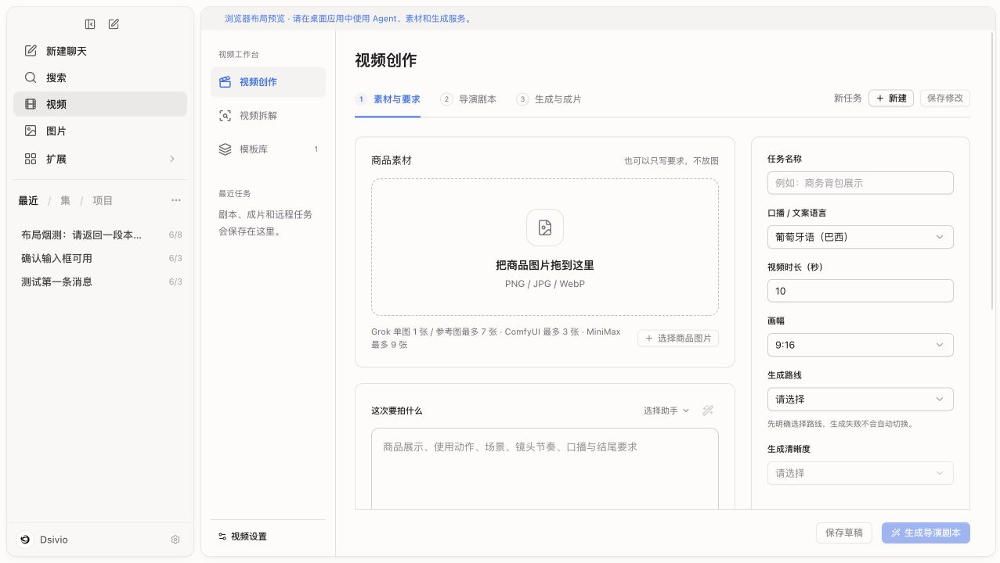
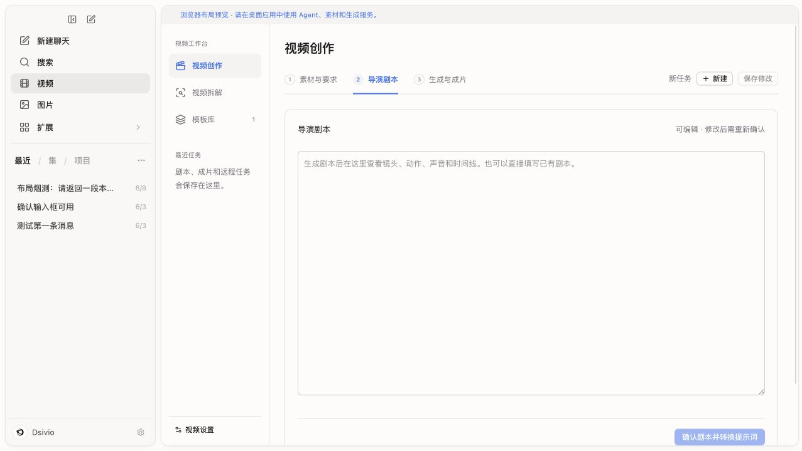
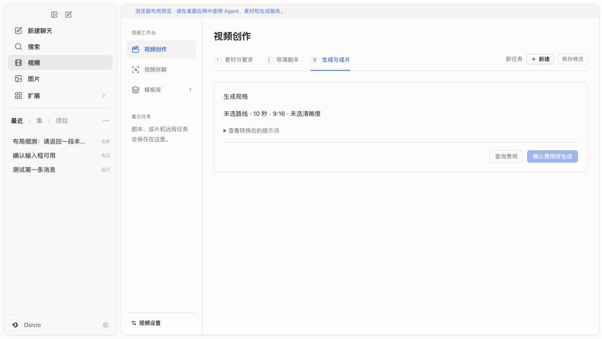
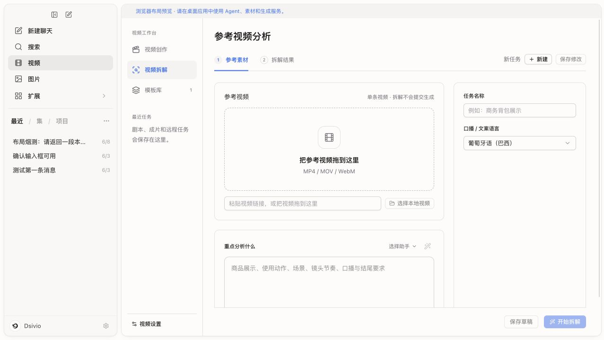
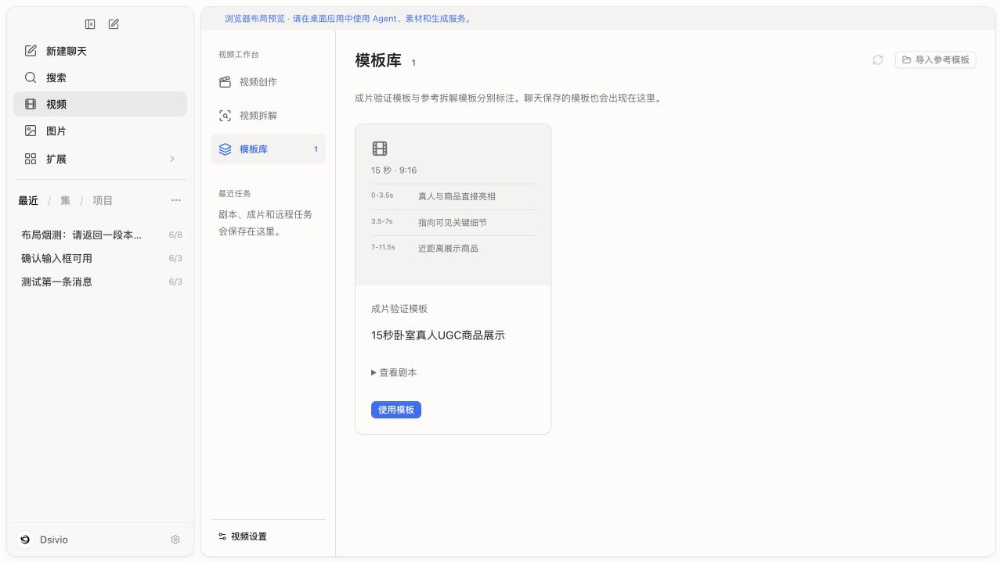

# Dsvideo 插件与工作台流程审查

日期：2026-09-09。上游源码：ZMGID/dsvideo-plugin，提交 `33af713d96d7d5d171080e23a618ed4fb37a6d8e`。
本次仅分析，未修改视频代码。文档中的技能规则是审查对象，不是本次执行指令。

## 结论

六个 Skill 不应对应六个功能页：导演、H3 提示词和供应商适配是内部协作环节。建议提供三个用户任务入口：视频创作、参考仿拍、视频拆解；模板库、任务和设置作为辅助入口，继续使用侧边栏。

| 入口 | 用户提供 | 用户得到 |
| --- | --- | --- |
| 视频创作 | 一句话要求，可选图片 | 拍摄方案、确认后的成片 |
| 参考仿拍 | 参考视频和自己的商品素材 | 沿用参考镜头结构、适配自己商品的成片 |
| 视频拆解 | 本地视频或链接，可选分析重点 | 逐镜头分析、可复用参考模板 |

参考仿拍是建议新增的完整交互，不是声称当前已有独立页面。它复用现有分析和创作能力；进入实际制作时仍需确认方案和生成服务。
文生视频、单图、多图由素材自动匹配；首尾帧是用户有意指定画面时的高级控制，不能靠自动猜测替代。服务选择不能因失败自动切换到收费供应商。

## 当前页面逐步证据

截图来自本次 localhost:5713 浏览器布局预览，约 1280 × 720。未配置执行服务，未上传或生成视频。步骤 2、3 是通过标签进入的空状态，不是已完成真实生成链路的证明。

### 1. 视频创作：素材与要求

- 优点：支持纯文字或商品图，侧边栏主入口少，下一步按钮固定可见。
- 问题：上传区域占据首屏主要面积，真正的拍摄要求被挤到下方；右侧提前展示任务名称、语言、路线、清晰度，上传下方混排三个供应商的数量限制。
- 默认语言为巴西葡萄牙语、默认有口播，不适合未明确市场与声音意图的通用创作入口。
- 建议：首屏保留素材、想拍什么、时长、画幅；声音使用简单选项，指定对白与配乐按需展开；任务自动命名和保存。服务选择保持清楚，但技术能力限制按已选服务与当前素材显示。

### 2. 导演剧本

- 页面只有大文本框和“确认剧本并转换提示词”，用户要自己读懂、编辑整段文档。
- 建议：默认展示可读分镜时间线，每段突出画面、动作和声音；提供“修改要求”和可选全文编辑。主按钮改为“确认方案”，模型提示词转换在后台处理。
- 空状态允许进入但缺乏明确的开始操作；不应让用户进入一整页空白后再寻找前置条件。

### 3. 生成与成片

- 现有“查询费用”是单独按钮；页面还暴露“转换后的提示词”。
- 建议：方案确认后自动准备提示词并查询报价，再展示已选服务、规格和金额，用户点击“确认并生成”。本地路线使用“开始生成”，不套用付费措辞。
- 当前代码由“查询进度 / 恢复结果”按钮触发 poll，未发现页面自动轮询。建议生成后自动更新状态、完成后显示播放器；远程编号等放进故障详情。提交结果未知时不能自动重提。

### 4. 视频拆解

- 优点：拆解与生成分离，单独接受链接或本地视频，保存模板有用户确认动作。
- 问题：沿用创作布局，右侧仅任务名称与“口播 / 文案语言”却占一大栏；分析重点被压到首屏下方。
- 建议：参考视频/链接和可选分析要求放在紧凑主区；源视频语言自动检测，报告语言与口播语言分开。
- 当前结果主要通向“确认拆解并保存模板”。建议直接提供“用我的商品仿拍”，带入已确认结构，不强制先命名存库再寻找模板。

### 5. 模板库

- 优点：参考拆解与成片验证模板明确区分，保留这一点。
- 当前预览只有一张内置 UGC 模板，显示前三段文字，没有成片预览；不应为填补视觉空缺编造视频。
- 建议：有真实成片时显示封面与播放；没有成片则明确显示镜头目录。标签解释成片是否验证，使用操作带入素材与方案。

## 代码与上游文档发现

1. **分析重点没有传入模型。** `src-tauri/src/video_studio.rs:201–228` 的 analyze 分支向分析工具传 source 与 detail，再仅将 evidence 交给 Agent；没有加入 brief.request 或 brief.language。UI 的“重点分析什么”因此未进入本次分析模型输入。应补入用户要求，且区分源视频语言和报告语言。
2. **三个创意选择缺少明确状态。** 上游 video-director 对宽泛需求要求先给三个方案。桌面 plan 分支（同文件 198–200）却要求直接返回完整 script，前端 run('plan') 后直接进入剧本页。即使模型输出三种方案也没有结构化选择与继续编写状态。
3. **切换入口可能丢失未保存输入。** VideoStudio 的 creation/analysis 切换会调用 fresh，重置 brief、task 和 script，没有先保存或分别保留草稿。当前仍有“保存修改”“保存草稿”多个入口。
4. **上游产品定位冲突。** ecom-h3-video/SKILL.md 开头声明不做带货口播、UGC 或 CTA，但自带 bedroom-ugc-product-presenter-15s 模板包含真人口播与 CTA 动作。应统一为通用视频创作，商品真实性约束单独保留。
5. **上游与桌面供应商能力版本不同。** 本次上游 Grok Skill 仍写单图；桌面 VideoMediaOptions 和适配代码已包含最多 7 张参考图与音色。更新时需以经验证的能力表同步文档、UI、客户端和测试，不能直接用旧说明删掉新能力。

## 建议的完整操作顺序

视频创作：放素材并写要求 → 宽泛需求才选三个拍法之一 → 查看/修改方案 → 确认服务与规格、展示费用 → 确认生成 → 自动更新进度和本地成片。
参考仿拍：放参考视频和商品 → 拆解并适配商品 → 确认分镜 → 同一生成流程。
视频拆解：视频/链接 → 可选分析重点 → 查看关键帧与逐镜头报告 → 保存模板或进入仿拍。

任务命名、保存、提示词转换、分支匹配、轮询下载适合自动化。画幅、时长、实际拍摄意图、首尾画面控制和收费服务选择仍属于用户决策。
商品背面、内部、功能等不明信息不应编造；自动规划时优先避免无依据的镜头。

## 优先级与验证边界

先修复用户要求传递、创意选择、草稿保留与上游规则冲突，再整理功能衔接和表单，最后调整视觉。
截图显示小号灰色辅助文字、大片留白与首屏信息截断风险；未测量对比度，也未完成键盘、屏幕阅读器与缩放测试，不能据此宣称无障碍合规。
此次只审查源码和空状态页面；未验证真实模型分镜质量、收费报价、ComfyUI 节点、链接解析质量、成片或恢复路径。现有工作区还有其他任务的未提交视频修改，本文以读取时状态为准。

## 上游来源

- [主流程](https://github.com/ZMGID/dsvideo-plugin/blob/33af713d96d7d5d171080e23a618ed4fb37a6d8e/skills/ecom-h3-video/SKILL.md)
- [导演方案](https://github.com/ZMGID/dsvideo-plugin/blob/33af713d96d7d5d171080e23a618ed4fb37a6d8e/skills/video-director/SKILL.md)
- [视频拆解](https://github.com/ZMGID/dsvideo-plugin/blob/33af713d96d7d5d171080e23a618ed4fb37a6d8e/skills/video-reference-analysis/SKILL.md)
- [内置 UGC 模板](https://github.com/ZMGID/dsvideo-plugin/blob/33af713d96d7d5d171080e23a618ed4fb37a6d8e/skills/ecom-h3-video/templates/bedroom-ugc-product-presenter-15s.json)
